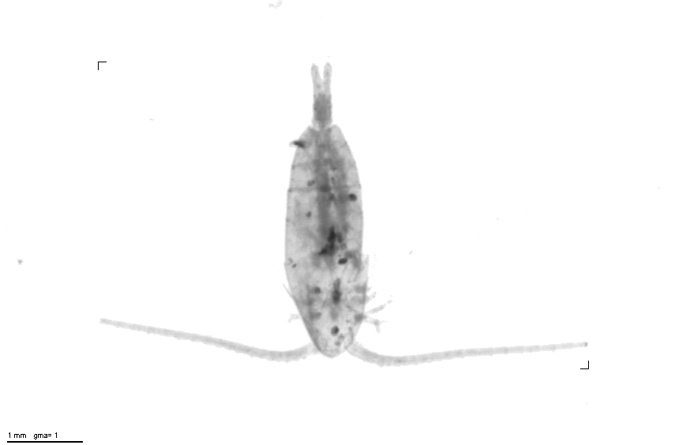

# ecotaxa-darwin-core

[Deno](https://deno.land) command-line tools for creating
[Darwin Core](https://dwc.tdwg.org/terms/) records from
[EcoTaxa](https://ecotaxa.obs-vlfr.fr/) exports.

## ecotaxa-occurrences

```sh
$ ecotaxa-occurrences -h

 Converts EcoTaxa NDJSON to Darwin Core Occurrences NDJSON

Use:
  ecotaxa-occurrences --project number < ecotaxa.ndjson

Options
  --project     EcoTaxa project number (integer)
  --country     Set country code
  --not-living  Also include records classified as not-living
```



## Examples

Minimal example

```sh
$ curl -s https://raw.githubusercontent.com/akvaplan-niva/ecotaxa-darwin-core/main/testdata/ecotaxa-doi-export-1-line.ndjson | ecotaxa-occurrences --project 818
{"scientificName":"Copepoda","organismQuantity":1,"organismQuantityType":"individuals","occurrenceStatus":"present","eventDate":"2017-08-31T11:11:11Z","fieldNumber":"n1_12m_dive_autumn_2017_large","catalogNumber":"n1_12m_dive_autumn_2017_large_tot_1_2","locality":"n1","basisOfRecord":"MachineObservation","verbatimEventDate":"20170831T111111","decimalLongitude":-14.78215,"decimalLatitude":78.375417,"maximumDepthInMeters":12,"minimumDepthInMeters":12,"samplingProtocol":"dive","samplingEffort":"dive mesh size 100 from rubber_boat","occurrenceID":"288a98e6-ee9f-5171-afaf-f9b61dd0af4d","datasetID":"16c02403-3bca-59d2-b057-c0c40958827b","eventID":"8753512a-b0bc-5480-a947-a9a0a5111853","parentEventID":"16c02403-3bca-59d2-b057-c0c40958827b","geodeticDatum":"WGS84","coordinateUncertaintyInMeters":30,"dateIdentified":"2018-05-14T00:00:00Z","identificationVerificationStatus":"validated","identificationRemarks":"living>Eukaryota>Opisthokonta>Holozoa>Metazoa>Arthropoda>Crustacea>Maxillopoda>Copepoda","identifiedBy":"https://ecotaxa.obs-vlfr.fr | User Name"}
```

Convert TSV to NDJSON and remove [Event](https://dwc.tdwg.org/terms/#event) metadata, using `nd-csv` and `nd-map` from [newline](https://github.com/cnrdh/newline).

```js
$ curl -s https://raw.githubusercontent.com/akvaplan-niva/ecotaxa-darwin-core/main/testdata/ecotaxa-doi-export-1-line.tsv \
  | nd-csv -ns \
  | nd-csecotaxa-occurrences --project 818 | nd-map '{eventDate,sampleSizeValue,sampleSizeUnit,locality,decimalLongitude,decimalLatitude,maximumDepthInMeters,minimumDepthInMeters,samplingProtocol,samplingEffort,eventRemarks,verbatimEventDate,geodeticDatum,coordinateUncertaintyInMeters, ...occurrence }=d, occurrence'
{"scientificName":"Copepoda","organismQuantity":1,"organismQuantityType":"individuals","occurrenceStatus":"present","fieldNumber":"n1_12m_dive_autumn_2017_large","catalogNumber":"n1_12m_dive_autumn_2017_large_tot_1_2","basisOfRecord":"MachineObservation","occurrenceID":"288a98e6-ee9f-5171-afaf-f9b61dd0af4d","datasetID":"16c02403-3bca-59d2-b057-c0c40958827b","eventID":"8753512a-b0bc-5480-a947-a9a0a5111853","parentEventID":"16c02403-3bca-59d2-b057-c0c40958827b","dateIdentified":"2018-05-14T00:00:00Z","identificationVerificationStatus":"validated","identificationRemarks":"living>Eukaryota>Opisthokonta>Holozoa>Metazoa>Arthropoda>Crustacea>Maxillopoda>Copepoda","identifiedBy":"https://ecotaxa.obs-vlfr.fr | User Name"}
```

## Test

```sh
deno test *test.js
running 12 tests
test EcoTaxa namespace is UUID v5 of EcoTaxa URL: https://ecotaxa.obs-vlfr.fr ... ok (5ms)
test datasetID is UUID v5 of project URL ... ok (2ms)
test occurrenceID is UUID v5 generated from catalogNumber in datasetID namespace ... ok (2ms)
test eventID is UUID v5 generated from fieldNumber in namespace parentEventID (or if missing: namespace datasetID) ... ok (2ms)
[…]
```

## Install

```sh
deno install https://raw.githubusercontent.com/akvaplan-niva/ecotaxa-darwin-core/main/ecotaxa-occurrences.js
```

```

```
